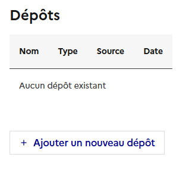
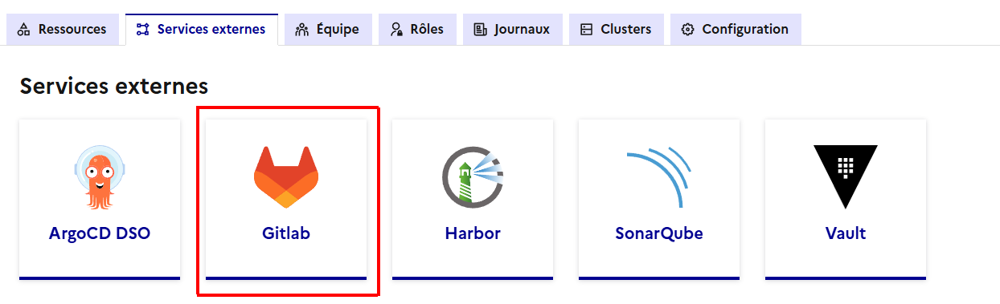
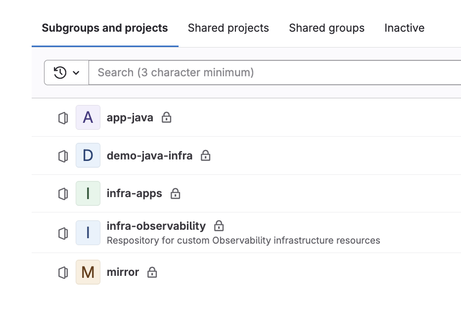
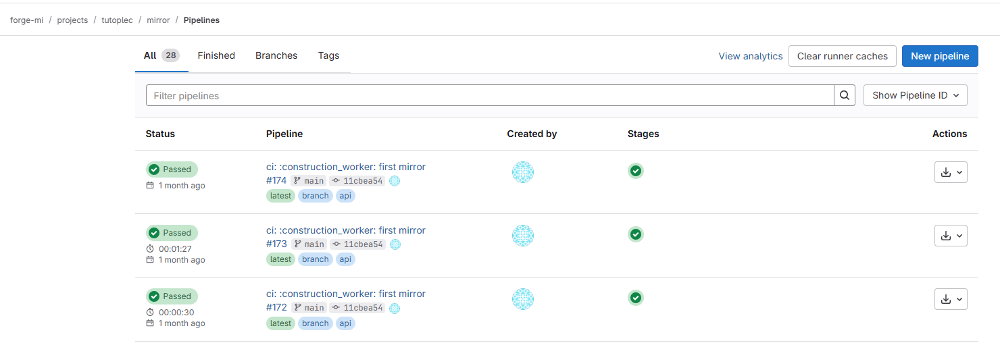
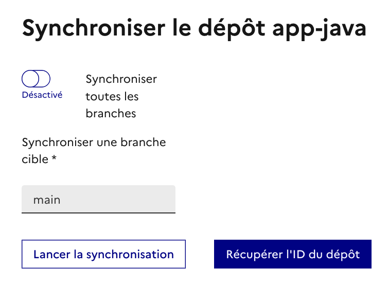
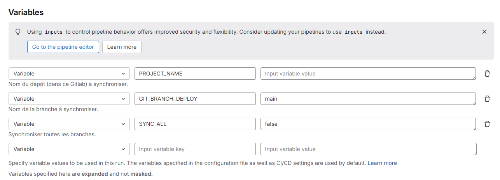
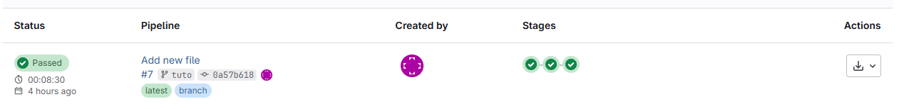
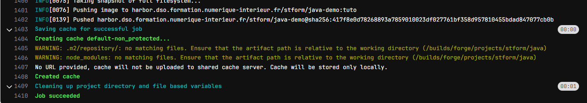
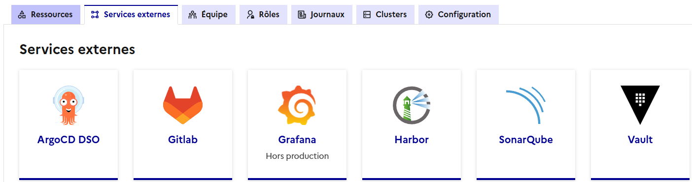
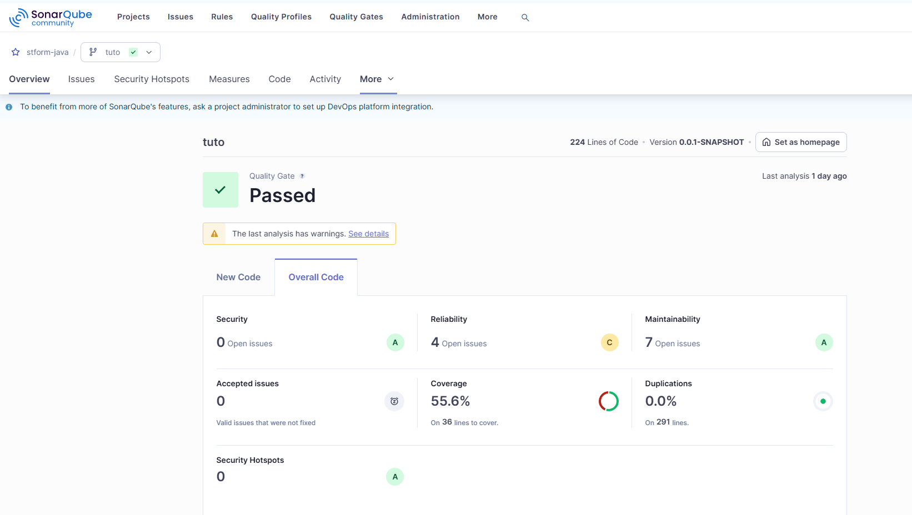

# Projet de tutoriel pour tester un déploiement sur Cloud Pi Native

## Description de l'application

Cette application est un backend Java listant des données en base de données. Les données présentes dans le fichier ```src\main\resources\db\data\demo.csv``` sont automatiquement chargées lors du premier démarrage de l'application :
```csv
id;name
1;Alice
2;Bob
3;Charles
4;Denis
5;Emily
```

### Processus de compilation et construction de l'application

Le concept de "multistage build" dans Docker permet de définir plusieurs étapes de construction dans un même Dockerfile. Chaque étape utilise une image de base différente et peut exécuter des commandes spécifiques. L'intérêt principal est de séparer la phase de compilation (qui nécessite souvent de nombreux outils et dépendances) de la phase d'exécution (qui n'a besoin que de l'artefact final, comme un fichier .jar). 

Ainsi, l'image finale est plus légère, plus sécurisée et ne contient que ce qui est strictement nécessaire pour faire tourner l'application. Dans l'exemple ci-dessus, la première étape utilise une image Maven pour compiler le projet, puis la seconde étape ne récupère que le .jar généré dans une image Java minimaliste, sans outils de build.


```Dockerfile
# First stage: complete build environment
FROM maven:3.9.7-eclipse-temurin-21 AS builder

# add pom.xml and source code
ADD ./pom.xml pom.xml
ADD ./src src/
RUN mvn clean package -Dmaven.test.skip=true

FROM gcr.io/distroless/java21:nonroot
WORKDIR /app
COPY --from=builder target/*.jar /app/app.jar

CMD ["-jar", "/app/app.jar"]
EXPOSE 8080
```

La construction de l'image applicative s'effectue donc par les étapes suivantes :
1. Construction de l'image Docker ```docker build```
2. Envoi de l'image construire dans le référentiel d'image ```docker push```

## Intégration à la chaine CPiN

### Ajout du dépôt externe

Ajouter le repo de code de cette application à l'offre Cloud Pi Native sur son projet.

1. Depuis un *projet*, aller dans l'onglet *Dépôt*, puis *ajouter un nouveau dépôt* :




 - *Nom du dépôt Git interne* : app-java

Le repo ne contient pas de code d'infrastructure et il possède des sources donc laisser les valeurs par défaut de la case à cocher et du radio bouton correspondant.

2. Renseigner *l'URL du repo externe* [https://github.com/cloud-pi-native/formation-cpin-repo-applicatif.git](https://github.com/cloud-pi-native/formation-cpin-repo-applicatif.git). Le repo est public, laissez donc décochée la case *Dépôt de source privé*

Cliquez sur le bouton *Ajouter le dépôt* et attendre que le dépôt apparaisse dans la console.

3. depuis l'onglet *Services externes* vérifier en cliquant sur le service Gitlab que le dépôt *app-java* est bien présent dans ses projets gitlab.



### Gitlab

Lors de l'accès à Gitlab à travers la console CPiN, celle-ci ouvre un nouvel onglet directement sur le groupe Gitlab correspondant à son projet. Ce groupe contient différents repos de codes :
 - infra-apps : Ce repos est créé automatiquement par la Console CPiN et est lié à une future feature, il n'est pas utilisé actuellement.
 - infra-observability : Ce repo est créé automatiquement par la Console CPiN et doit contenir les "dashboards as code" ( plus d'information dans la documentation [https://cloud-pi-native.fr/agreement/observability#dashboard-as-code](https://cloud-pi-native.fr/agreement/observability#dashboard-as-code)
 - mirror : Ce repos est créé automatiquement par la Console CPiN et contient le job Gitlab-ci permettant de synchroniser le repo externe vers le repo interne.
 - les repos de codes et d'infrastructure déclarés dans la console

Exemple :



Les jobs de synchronisation peuvent se voir depuis le repo mirror puis dans le menu Build->pipelines :


L'exécution de ce job peut se faire : 
 - Depuis la console sur le repo puis en cliquant sur le bouton ```Lancer la synchronisation```. A noter que lors de l'ajout d'un repo une première synchronisation de toutes les branches et effectuée par la console.
 

 - Depuis Gitlab depuis le projet mirror, aller dans Build -> pipeline puis cliquez sur le bouton ```New Pipeline```




### Ajout du fichier gitlab-ci

Afin de construire notre application, Gitlab est configurée pour utiliser un fichier gitlab-ci nommé **.gitlab-ci-dso.yml** présent à la racine du projet.

Pour des raisons de facilité, nous allons travailler directment à partir du repo de code de Gitlab et non depuis le repo externe, dans un mode projet, il conviendrait de travailler depuis le repo externe et de procéder à des synchronisation repo externe -> repo interne.

1. Depuis Gitlab, aller dans le projet *app-java* et choisir la branche *tuto* puis sur le bouton *edit* -> *web IDE* créer un fichier ```.gitlab-ci-dso.yml``` à la racine du projet. Attention à bien nommé le fichier *exactement* ```.gitlab-ci-dso.yml``` faute de quoi il ne serait pas pris en compte.

2. Ajouter la première partie suivante :

```yaml
include:
  - project: $CATALOG_PATH
    file:
      - vault-ci.yml
      - kaniko-ci.yml
    ref: main
  - local: "/includes/java-mvn.yml"
```

Cette partie permet de charger les taches pré-définies et pré-paramétrées pour s'exécuter dans CPiN. Pour plus d'information sur le catalogue, voir le repo [dédié](https://github.com/cloud-pi-native/gitlab-ci-catalog)

Ajouter ensuite la partie suivante qui permet de définir les valeurs à mettre en cache, les variables et les étapes de construction:

```yaml
cache:
  paths:
    - .m2/repository/
    - node_modules

variables:
  TAG: "${CI_COMMIT_REF_SLUG}"
  DOCKERFILE: Dockerfile
  REGISTRY_URL: "${IMAGE_REPOSITORY}"

stages:
  - read-secret
  - test-app
  - docker-build
  ```

la construction du projet se fait en plusieurs étapes :
1. Lecture des secrets du projet (token gitlab, Nexus, Sonarqube etc.) par la tache vault-ci
2. Exécution des tests unitaires
3. Construction de l'image docker et push vers Harbor par la tache kaniko-ci

#### Lecture des secrets

Ajouter le bloc suivant pour lire les secrets du projet depuis Vault :

```yaml
read_secret:
  stage: read-secret
  extends:
    - .vault:read_secret
```

#### Qualimétrie de l'application
Ajouter la partie qualimétrie (Sonarqube) sur le même principe :

```yaml
test-app:
  variables:
    BUILD_IMAGE_NAME: maven:3.8-openjdk-17
    WORKING_DIR: .
  stage: test-app
  extends:
    - .java:sonar
  allow_failure: true
```

Cette partie permet de créer le projet sur l'instance SonarQube CPiN

#### Construction de l'image et déploiement sur Harbor

Ajouter enfin le bloc suivant pour construire et déployer l'image Docker sur Harbor :

```yaml
docker-build:
  variables:
    WORKING_DIR: "."
    IMAGE_NAME: java-demo
  stage: docker-build
  extends:
    - .kaniko:simple-build-push
```

Pour information, le bloc ci-dessus est une extension de la tache suivante issue du catalogue:

```yaml
.kaniko:simple-build-push:
  variables:
    DOCKERFILE: Dockerfile
    WORKING_DIR: .
    IMAGE_NAME: $IMAGE_NAMES
    EXTRA_BUILD_ARGS: ""
  image:
    name: gcr.io/kaniko-project/executor:debug
    entrypoint: [""]
  script:
    # CA
    - if [ ! -z $CA_BUNDLE ]; then cat $CA_BUNDLE >> /kaniko/ssl/certs/additional-ca-cert-bundle.crt; fi
    - mkdir -p /kaniko/.docker
    - echo "$DOCKER_AUTH" > /kaniko/.docker/config.json
    - /kaniko/executor --build-arg http_proxy=$http_proxy --build-arg https_proxy=$https_proxy --build-arg no_proxy=$no_proxy $EXTRA_BUILD_ARGS --context="$CI_PROJECT_DIR" --dockerfile="$CI_PROJECT_DIR/$WORKING_DIR/$DOCKERFILE" --destination $REGISTRY_URL/$IMAGE_NAME:$TAG
```

### Fichier .gitlab-ci-dso.yml complet
Le fichier .gitlab-ci-dso.yml complet est le suivant :

```yaml
include:
  - project: $CATALOG_PATH
    file:
      - vault-ci.yml
      - kaniko-ci.yml
    ref: main
  - local: "/includes/java-mvn.yml"

cache:
  paths:
    - .m2/repository/
    - node_modules

variables:
  TAG: "${CI_COMMIT_REF_SLUG}"
  DOCKERFILE: Dockerfile
  REGISTRY_URL: "${IMAGE_REPOSITORY}"

stages:
  - read-secret
  - test-app
  - docker-build

read_secret:
  stage: read-secret
  extends:
    - .vault:read_secret

test-app:
  variables:
    BUILD_IMAGE_NAME: maven:3.8-openjdk-17
    WORKING_DIR: .
  stage: test-app
  extends:
    - .java:sonar
  allow_failure: true

docker-build:
  variables:
    WORKING_DIR: "."
    IMAGE_NAME: java-demo
  stage: docker-build
  extends:
    - .kaniko:simple-build-push
```

## Exécution de la chaine CI par gitlab

Une fois que ce fichier est créé et commit / push sur le repos git, retourner sur le projet gitlab *app-java* puis dans le menu *build* -> *pipelines* puis cliquez sur le bouton *Run pipeline*

Le pipeline cherche automatiquement le fichier *.gitlab-dso.yaml* à la racine du projet et lance le pipeline.



Le build s'est bien passé si les 3 étapes sont vertes. Il est possible de consulter les logs associées à chacune des étapes en cliquant sur la coche verte (ou sur l'erreur si le build est KO)

Les logs d'un build OK sur la troisième étape de build se terminent par une étape de push de l'image docker sur Harbor puis le log final Job succeeded :




## SonarQube

Une fois le projet construit, il est possible de consulter le rapport SonarQube. Pour cela, depuis la console, aller dans *Services externes* puis cliquez sur la tuile SonarQube : 



Depuis l'onglet *projects* de *SonarQube* cliquez sur le projet java et choisir la branche tuto en haut à gauche pour afficher les informations du projet : 




> Bravo vous avez terminé le tutoriel de construction applicatif !